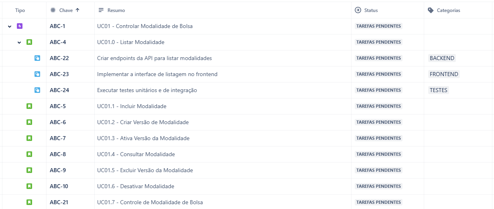

***Objetivo do Documento:** Detalhar como a escrita de Epics, User Stories e Subtasks no Jira devem se feita, tomando como base a documentação de Análise. Como exemplo, usaremos os Casos de Uso "Cadastrar Resolução", "Cadastrar Modalidade" e "Cadastrar Nível".*

## Quais são os tipos de itens (issues) no Jira?
O Jira tem diferentes tipos de itens para categorização do trabalho. Como issues default, nessa ordem de hierarquia, temos:

- **Epic:** Representa um grande volume de trabalho. **Correspondem aos Casos de Uso.** 
- **User Story (US):** Representa um requisito expresso, comumente a partir da perspectiva do usuário. Seu objetivo é articular como um recurso de software pode gerar valor para o cliente. **Correspondem aos Eventos dos Casos de Uso**.     
- **Subtask:** Representa a divisão mais granular do trabalho necessário para concluir um item padrão.

### O que são itens vinculados?
Além da relação pai-filho entre itens, também é existem as dependências entre as tarefas. Essa associação pode ser representada com facilidade no Jira ao vincular itens. As associações prontas para uso são:
1. bloqueia/é bloqueado por
2. clona/é clonado por
3. duplica/é duplicado por
4. Relacionado a

Sendo as dependências 1 e 4 as de maior interesse. Todos os itens vinculados são exibidos em cada item. Isso torna mais fácil para as equipes navegar entre o trabalho conectado e exibir as dependências.

## O que são itens pai e filho?
Pai e filho são termos que descrevem um tipo de relacionamento entre itens:

- Um item pai é um item que fica um nível acima de outro item, por exemplo, uma US composta de subtarefas.
- Um item filho é um item que fica um nível abaixo de outro item, por exemplo, uma US que pertence a um Epic.

O relacionamento entre pai e filho não se limita a tipos de itens específicos. Em vez disso, qualquer tipo de item pode ser um item de pai e filho. A única exceção são as subtarefas, que só podem ser um item filho, já que não há nenhum tipo de item abaixo dela na hierarquia.

# Exemplo de Construção de Tarefas
Tomando como base a documentação "Especificação de Análise – Módulo Cadastro de Modalidades de Bolsas", veja os casos de usos que serão utilizados como exemplo:

| **ID** | **Caso de Uso**               | **Eventos**                                                                                                                                                                                             |
|--------|-------------------------------|--------------------------------------------------------------------------------------------------------------------------------------------------------------------------------------------------------|
| UC01   | Controlar Modalidade de Bolsa | Listar Modalidade, Incluir Modalidade, Criar Versão de Modalidade, Alterar Versão da Modalidade, Ativar Versão da Modalidade, Consultar Modalidade, Excluir Versão de Modalidade, Desativar Modalidade |
| UC02   | Cadastrar Resolução           | Listar Resolução, Incluir Resolução, Alterar Resolução, Consultar Resolução, Excluir Resolução                                                                                                         |
| UC03   | Cadastrar Nível de Bolsa      | Listar Nível, Incluir Nível, Alterar Nível, Consultar Nível, Excluir Nível                                                                                                                             |

Atente-se as correspondências: **Casos de Usos tornam-se Epics**, que são comuns a todas as equipes.
Já os **Eventos dos Casos de Uso tornam-se Histórias de Usuário**;

As subtarefas são específicas para cada time (FrontEnd, BackEnd, Design, Análise, etc...) e devemos utilizar a propriedade "Categorias" para indicar o time responsável pela subtarefa em questão. Veja o exemplo abaixo:

